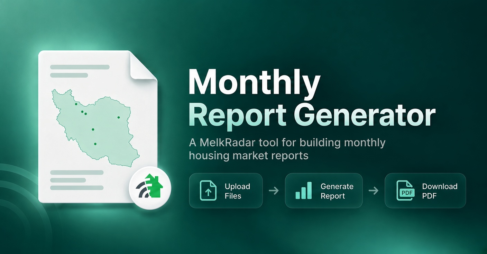

# MLK Monthly Report Generator

Turn monthly MelkRadar Excel data into a validated, print-ready housing market report.

[](https://github.com/Ali-Sdg90/mlk-monthly-report-generator/actions/workflows/release.yml)
[](https://github.com/Ali-Sdg90/mlk-monthly-report-generator/releases)




## Overview

This internal React application validates two monthly XLSX workbooks and turns their housing-market data into a fixed A4 RTL report that can be printed or saved as PDF.

The current report contains a cover, an About page, a city summary, and regional pages for Tehran, Karaj, Mashhad, Shiraz, Isfahan, and Northern Cities.

Designed and developed by **Ali Sadeghi** for **MelkRadar**.

[Open the live application](https://ali-sdg90.github.io/mlk-monthly-report-generator/)

## Local development

Node.js 22 is recommended.

```bash
npm ci
npm run dev
```

Run the project checks with:

```bash
npm run check
```

## Input

The application expects two `.xlsx` files. Each workbook must contain exactly two valid period sheets, with the newer period first:

1. **All Cities Price Analysis**
2. **All Cities Zones Price Analysis**

For required columns and validation rules, see the [Project Guide](docs/PROJECT_GUIDE.md#workbook-contract).

## Documentation

- [Project Guide](docs/PROJECT_GUIDE.md): architecture, data contract, report structure, and verification
- [Changelog](CHANGELOG.md): generated release history

## Release

Pushes to `main` are checked, released with semantic-release, and deployed to GitHub Pages. Commit messages follow Conventional Commits.

## License

This is proprietary software owned by MelkRadar. See [LICENSE](LICENSE).
